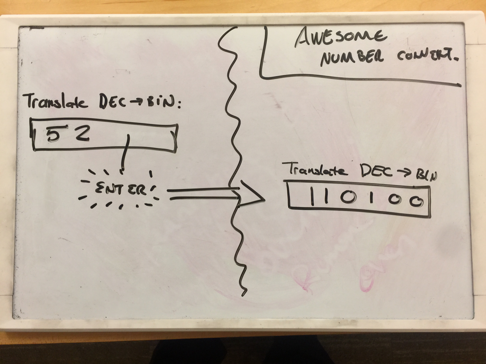

# Number Translator Widget

## Learning Objectives

* Task 1: Name steps in mockup, static, widget design strategy
* Task 2: Identify atomic widget(s) from a mockup and create

## Summary

To warm you up to the daily life of a software designer, your boss came in this
morning and gave you this mock-up.

The requirement is that you will type a decimal number. When you hit RETURN the
decimal number will be replaced with its BINARY representation. For this MVP
release, you can assume the decimal (base-10) number is greater than 0.

As a refresher, Base-10 is *decimal* (_Latin_ "decimus" meaning, "tenth").
Base-2 is *binary* (_Latin_ "bini" meaning "by two"). Here are a few sample
data:

|Decimal|Binary|
|-------|------|
|0      |0     |
|1      |1     |
|2      |10    |
|3      |11    |
|4      |100   |
|52     |110100|

Many programming languages (including Ruby!) allow you to enter numbers in
different bases. For example, `0b110100` in Ruby returns `52`.

Use the design strategy demonstrated today to iterate through successive
releases toward a real Widget. You will use your Node + NPM environment
construction skills from Day 01 as well.

## Releases

### Release 0: Build Your Environment

As with last week, you're going to need to create a Node + NPM environment for
running your code. You can use the npm package `local-web-server` to start a
server in your code directory. Add an `index.html` file and link in a css file
and an JavaScript file. Ensure your HTML, CSS, and a basic JavaScript
environment is working before proceeding.

### Release 1: Build a Static Version

Follow the process that was detailed today.

1. Mark off where Widgets likely exist
2. Create a static version of this site
  * Ensure CSS concerns are in a CSS file
  * Structural work is done in the HTML file
  * Your JavaScript file shouldn't be doing any real work (yet...)
3. Create a "Widget"

### Release 2: Build Your Widget

Build a Widget class that "takes over" management of a piece of the DOM.

**HINT**: Create a `state` object that updates with each keyUp event. When
"RETURN" is struck, trigger `render` where the text field's content updates to
a binary representation of the number.

**HINT**: You _do not_ need to create a submit button here. That's actually 
making things harder! Type in a decimal number, strike enter, the decimal number
should go away and be replaced by a binary representation. That's it. Another
programmer virtue is learning not to make things harder than they have to be. ;)
Another important point is that a submit button _is not in the mockup_. If your
client meant for it to be there _they would have put it in there_.

## Stretch Releases

### Stretch 1: Add Error Mitigation

Prevent users from entering non-numbers like "PUMPKIN"

### Stretch 2: Update the Smallest Bit of DOM

Evaluate how much DOM you're replacing. Realize that for every element you
replace there's a performance cost. Can you update the code to update the
tiniest bit possible?

## Conclusion

Congratulations, you've discovered two virtues of React:

### REACT VIRTUE 1: DISCIPLINE AROUND CREATING DOM-MANIPULATING CLASSES

There's no reason the name has to be `render()`, there's no reason data are
saved in `this.state` or `this.props`. These choices are the choices of your
DBC curriculum authors. In practice, various programming enterprises set up
their own particular style for building JS applications. This brings in a
certain amount of cognitive burden and prohibits sharing of strategies and
approaches. In short, it requires programmers to think about decisions that
are, by-in-large, unimportant. React's Widgets, which it calls "Components"
ease programmer cognitive burden.

### REACT VIRTUE 2: DO THE SMALLEST POSSIBLE DOM UPDATE

React efficiently automatically finds the smallest bit of DOM to update using
an approach called VirtualDOM. It keeps a "virtual" copy of its Widgets'
attributes and does the smallest update required. This creates speed when you
have multiple widgets

### REACT VIRTUE 3: SMART TEMPLATES

Embedding HTML string manipulation is not fun. In the pre-ES6 world
(where we gained template string), it was even more painful. We had to cobble
strings together with `+` or similar.

React, through a technology called JSX makes it possible to make ES6 templates
_even smarter_. We'll experience this smart HTML syntax shortly.
